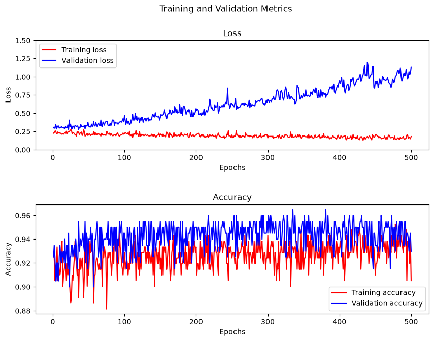
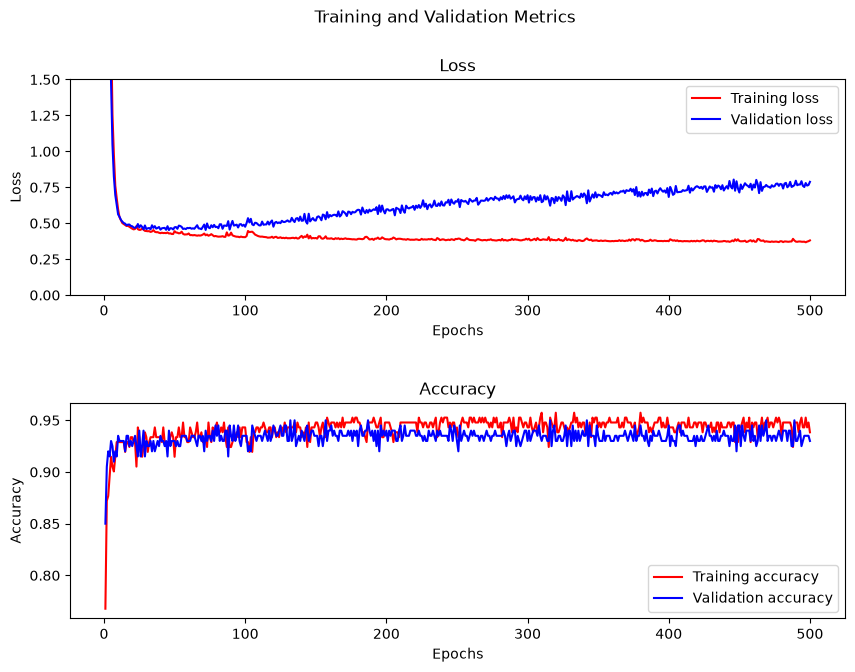

# 🧤 Goalkeeper - Intelligent Goalkeeper Analysis Using AI

## 📌 Overview

This project focuses on developing an AI-based goalkeeper analysis system using Machine Learning and Computer Vision techniques.

The main goal is to analyze goalkeeper-related data, extract meaningful features, and build a model capable of understanding goalkeeper performance and behavior.

The project explores how Artificial Intelligence can be applied in sports analytics, especially for goalkeeper evaluation and decision-making.

---

## 🎯 Objectives

- Analyze goalkeeper performance using data-driven approaches
- Apply Machine Learning algorithms for prediction/classification
- Extract important features affecting goalkeeper performance
- Evaluate model performance using appropriate metrics
- Provide insights for sports analysis applications

---

## 🧠 Methodology

The project pipeline consists of:

1. **Data Collection**
   - Dataset preparation and exploration
   - Data cleaning and preprocessing

2. **Data Preprocessing**
   - Handling missing values
   - Feature engineering
   - Feature scaling and encoding

3. **Model Development**
   - Training Machine Learning models
   - Hyperparameter tuning
   - Model comparison

4. **Evaluation**
   - Accuracy
   - Precision
   - Recall
   - F1-score
   - Confusion Matrix

---

## 🛠️ Technologies Used

- Python
- NumPy
- Pandas
- Scikit-learn
- Matplotlib
- Seaborn
- TensorFlow / Keras

---


---

## 📊 Results

The developed models were evaluated based on different performance metrics.


| Model  
|Model l1l2

---

## 🚀 How to Run

Clone the repository:

```bash
git clone https://github.com/delanorouzi/Goalkeeper.git
